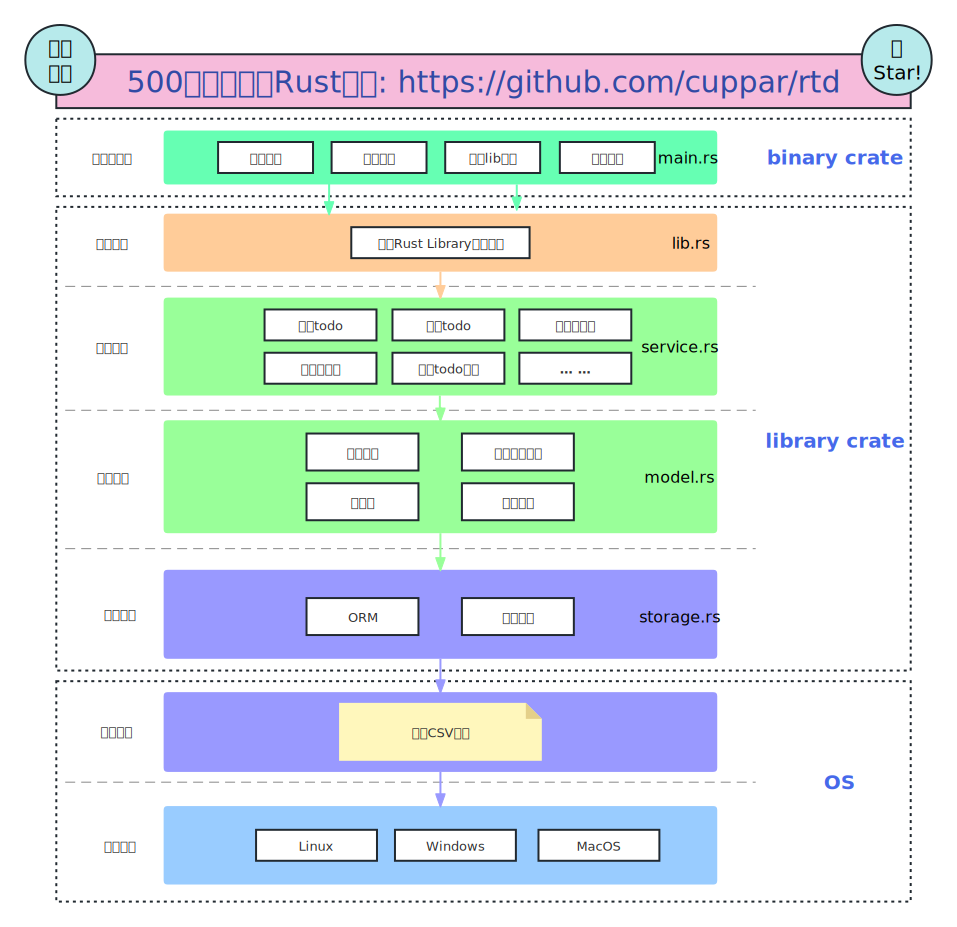

# Learn Rust by 500 lines code
English | [中文](https://github.com/cuppar/rtd/blob/master/readme_zh.md)

- RTD (Rust To Do) is a todo app cli tool write by 500 lines Rust code. (exclude space lines/comments/long line break display/test code)
- RTD is also a [tutorial(TODO)](), designed to learn Rust by doing.

## Table of contents

- [What's can you learn from rtd?](#whats-can-you-learn-from-rtd)
- [Prepare](#prepare)
- [Install](#install)
- [Usage](#usage)

---

## What's can you learn from RTD?

#### Through the [Learn Rust by 500 lines code(TODO)]() tutorial, step by step to build the project from scratch, you will learn:
  - Rust common syntax
  - Rust module system (`package`/`binary crate`/`library crate`/`mod`/`pub`/`use`)
  - Rust ownership model (Bernstein conditions)
  - Rust error/null handling model (`Result<T, E>`/`Option<T>`)
  - Rust generic
  - Rust pattern matching (`if let` , `match` ...)
  - Rust unit test
  - Rust file I/O (`File Seek`/`Buffed File I/O`)
  - Rust manipulating environment variables
  - Rust command line parameter parsing
  - Rust release package to crate.io
  - Layered abstraction (data storage layer/model mapping layer/data model layer/business logic layer/application interface layer/user interface layer)
  - Handwritten serialization/deserialization from scratch
  - Implement the recycle bin function (virtualization concept)

###### Architecture



###### Storage
Use a local file `$HOME/.rtd.csv` store all data


#### After completing this tutorial or installing RTD directly, you will get:
  - Extremely lightweight and concise todo command line application
  - Cross-platform, Rust's excellent build system naturally supports cross-platform
  - Safe, supports recycle bin, completely local, no network, no database
  - All data storage uses only one local csv file, which can be switched between different machines by copying the csv file

---
If you like my tutorial, don't forget to give me a star~
---

## Prepare

- Rust is naturally cross-platform. This project is built and tested in the `linux` environment, and `Windows`/`MacOS` are also supported. You can choose to download the corresponding `Cargo` according to your own operating system.
- `Cargo` Rust's package management and build tool, can be installed directly through the [Rust official website](https://www.rust-lang.org/tools/install) `rustup` one line command. Then, all things will be done by `Cargo`, so cute, right?

## Install

#### Via `crate.io` :

```bash
cargo install rtd-tutorial
```

#### Or via `git repo` :
```bash
git clone https://github.com/cuppar/rtd.git
cargo install --path rtd
```

## Usage

#### view help document
```bash
rtd -h
rtd --help
```


#### add a todo
```bash
rtd -a <item-name>
rtd --add <item-name>
```


#### List all uncompleted todos
```bash
rtd
rtd -l
rtd -l uncompleted
rtd --list
rtd --list uncompleted
```


#### Complete a todo
```bash
rtd -c <item-id>
rtd --complete <item-id>
```


#### List all completed todos
```bash
rtd -l completed
rtd --list completed
```


#### uncomplete a todo
```bash
rtd -u <item-id>
rtd --uncomplete <item-id>
```


#### Throw a todo into the recycle bin
```bash
rtd -d <item-id>
rtd --delete <item-id>
```


#### List all recycle bin todos
```bash
rtd -l deleted
rtd --list deleted
```


#### Restore a todo from the recycle bin
```bash
rtd -r <item-id>
rtd --restore <item-id>
```


#### Physically destroy a todo
```bash
rtd --destroy <item-id>
```


#### Empty recycle bin
```bash
rtd --destroy-deleted
```


#### List all todos
```bash
rtd -l all
rtd --list all
```


#### Clear all todos
```bash
rtd --clear
```


