# 500行代码学会Rust
[English](https://github.com/cuppar/rtd#learn-rust-by-500-lines-code) | 中文

- `RTD` (Rust To Do) 是一个用500行Rust 代码编写的todo app命令行应用。（不包括空行/注释/长行折断显示/测试代码）
- `RTD` 同时也是一个[教程(TODO)]()，旨在通过实践学习Rust。
- Learning by doing!

## 目录

- [你能从RTD学到什么？](#你能从rtd学到什么)
- [准备](#准备)
- [安装](#安装)
- [使用](#使用)
- [关于作者](#关于作者)

---

## 你能从RTD学到什么？

#### 通过[500行代码学会Rust(TODO)]()教程，一步步从零构建该项目，你将学会：
  - Rust常用语法
  - Rust模块系统(`package`/`binary crate`/`library crate`/`mod`/`pub`/`use`)
  - Rust所有权模型(伯恩斯坦条件)
  - Rust生命周期
  - Rust错误/空值处理(`Result<T, E>`/`Option<T>`)
  - Rust泛型
  - Rust模式匹配(`if let` , `match` ...)
  - Rust单元测试
  - Rust文件读写(`File Seek`/`Buffed File I/O`)
  - Rust操作环境变量
  - Rust命令行参数解析
  - Rust发布包至crate.io
  - 分层抽象(数据存储层/模型映射层/数据模型层/业务逻辑层/应用接口层/用户接口层)
  - 从零手写序列化/反序列化
  - 实现回收站功能（虚拟化概念）

###### 架构图

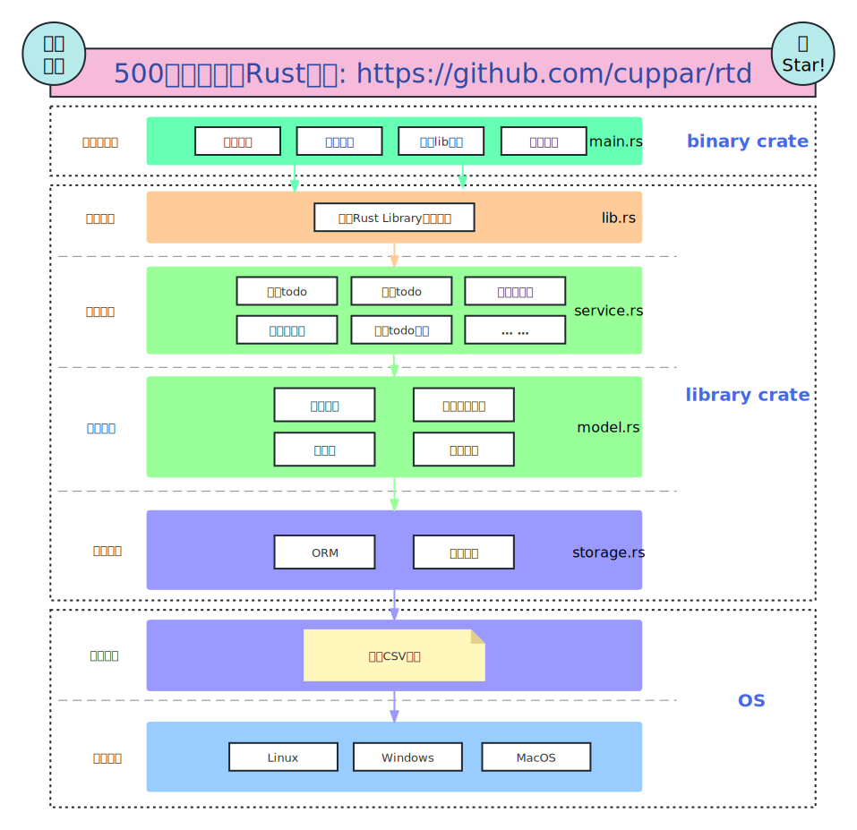

###### 存储
使用一个本地文件 `$HOME/.rtd.csv` 存储所有数据

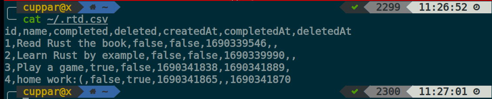

#### 完成该教程或直接安装RTD，你将得到:
  - 极其轻量级且简洁的todo命令行应用
  - 跨平台，Rust项目优秀的构建系统天然支持跨平台
  - 安全，支持回收站，完全本地，不联网，无数据库
  - 所有数据存储仅使用一个本地csv文件，可以通过复制csv文件来在不同机器间切换

---
如果你喜欢我的教程，别忘了给我点个Star哦～
---

## 准备

- Rust 天然跨平台，本项目在 `linux` 环境构建测试，`Windows`/`MacOS` 同样支持，根据自身操作系统选择下载对应 `Cargo` 即可。
- `Cargo` Rust 包管理和构建工具, 可通过[Rust官网](https://www.rust-lang.org/tools/install)`rustup`一行命令直接安装，接下来的事情，它会帮你全搞定，很可爱，不是吗？

## 安装

#### 通过 `crate.io` :

```bash
cargo install rtd-tutorial
```

(PS: 如果遇到网络不稳定的情况，可考虑使用 [crates.io mirror](https://rsproxy.cn/)

#### 或者通过 `git repo` :
```bash
git clone https://github.com/cuppar/rtd.git
cargo install --path rtd
```

## 使用

#### 查看帮助说明
```bash
rtd -h
rtd --help
```

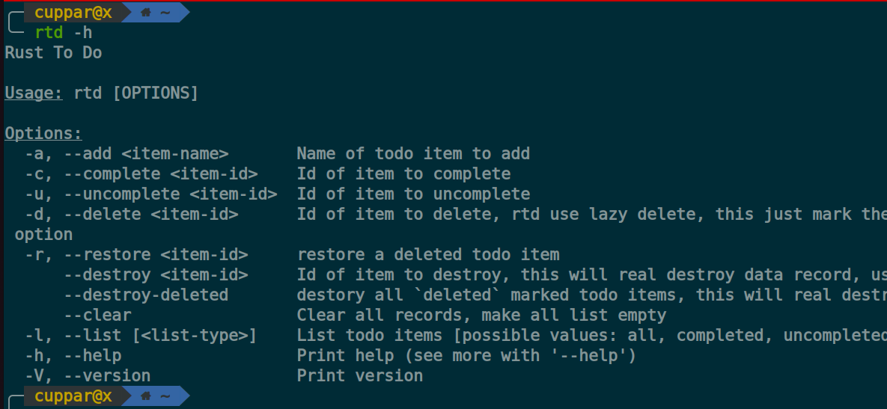
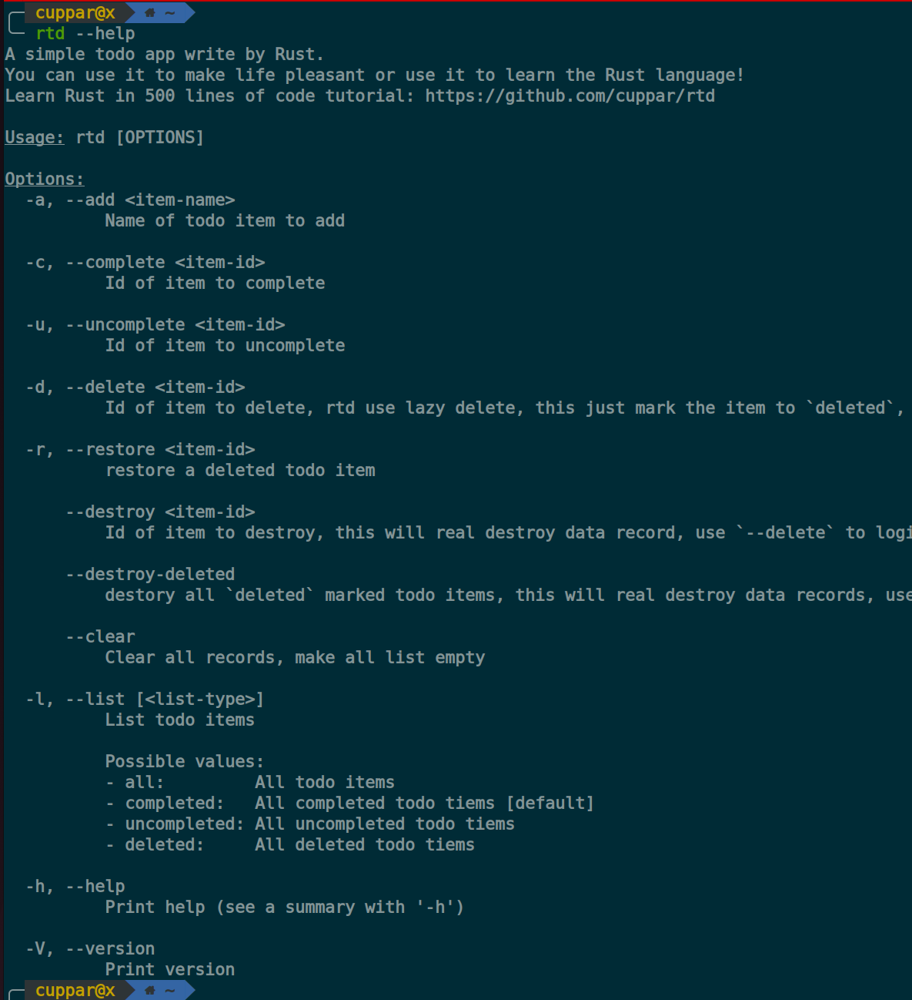

#### 添加一个todo
```bash
rtd -a <item-name>
rtd --add <item-name>
```

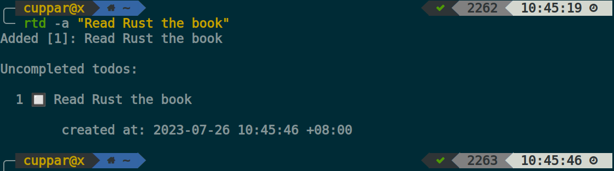

#### 列出所有未完成的todo
```bash
rtd
rtd -l
rtd -l uncompleted
rtd --list
rtd --list uncompleted
```

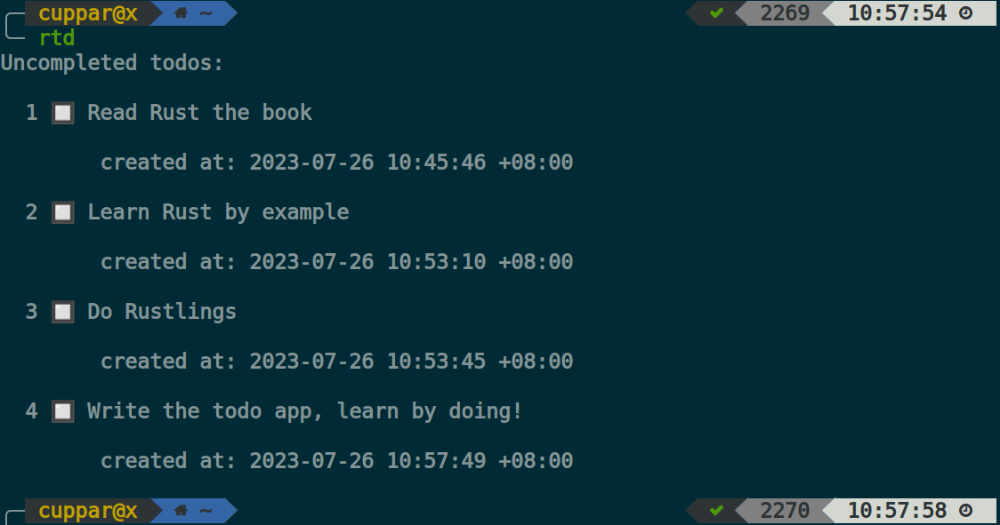

#### 完成一个todo
```bash
rtd -c <item-id>
rtd --complete <item-id>
```

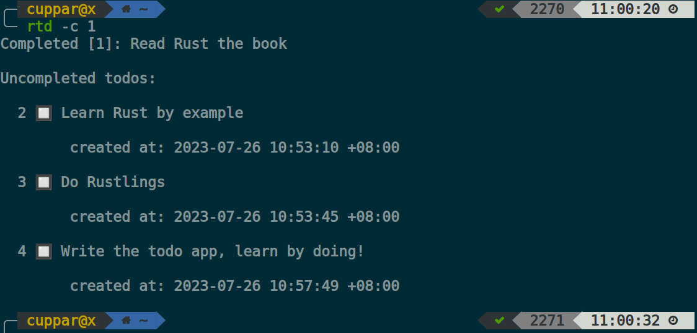

#### 列出所有已完成的todo
```bash
rtd -l completed
rtd --list completed
```

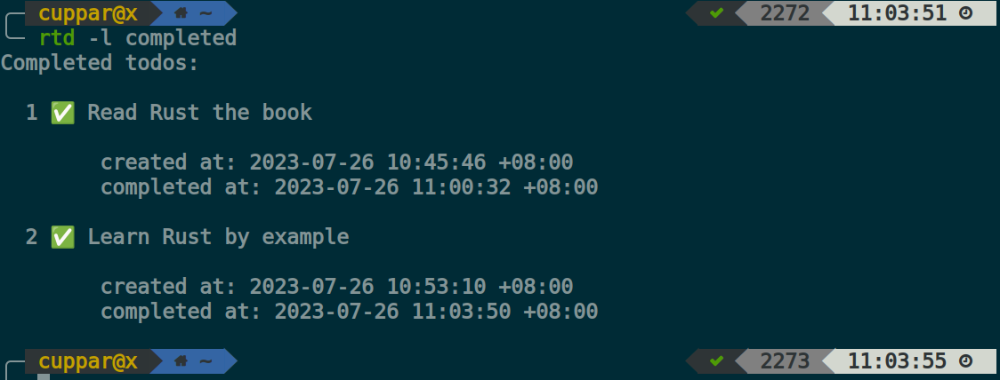

#### 标记一个todo为未完成
```bash
rtd -u <item-id>
rtd --uncomplete <item-id>
```

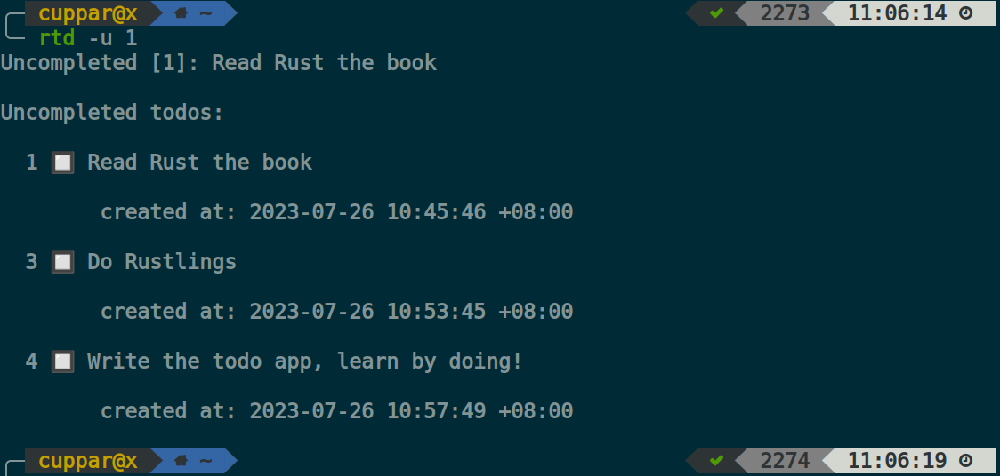

#### 把一个todo扔进回收站
```bash
rtd -d <item-id>
rtd --delete <item-id>
```

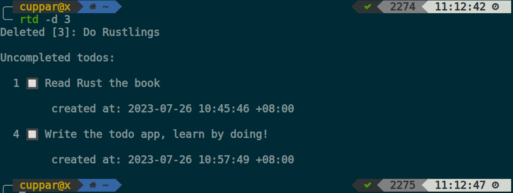

#### 列出所有回收站的todo
```bash
rtd -l deleted
rtd --list deleted
```

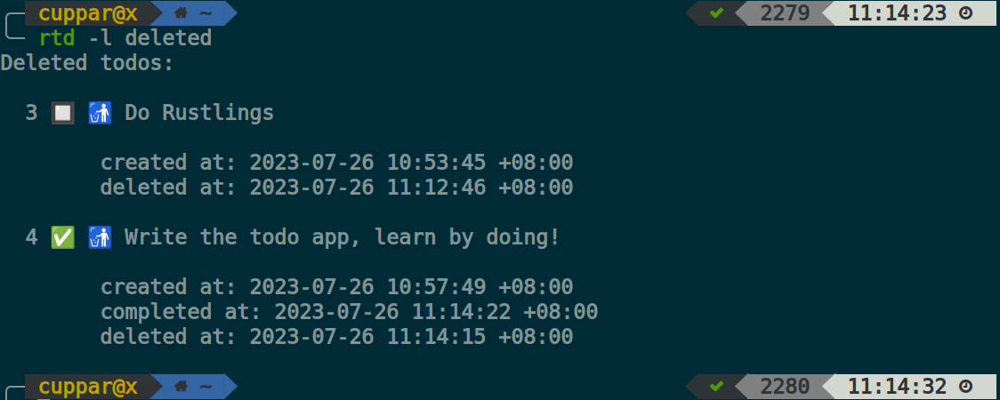

#### 从回收站恢复一个todo
```bash
rtd -r <item-id>
rtd --restore <item-id>
```

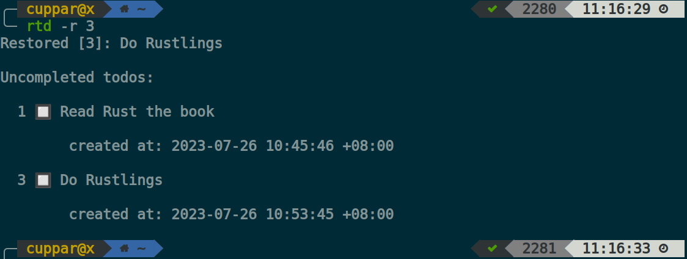

#### 物理销毁一个todo
```bash
rtd --destroy <item-id>
```

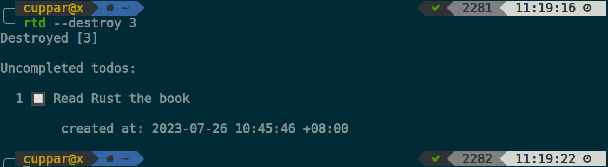

#### 清空回收站
```bash
rtd --destroy-deleted
```

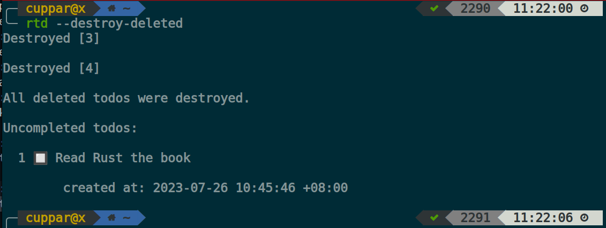

#### 列出所有todo
```bash
rtd -l all
rtd --list all
```


#### 清空所有todo
```bash
rtd --clear
```

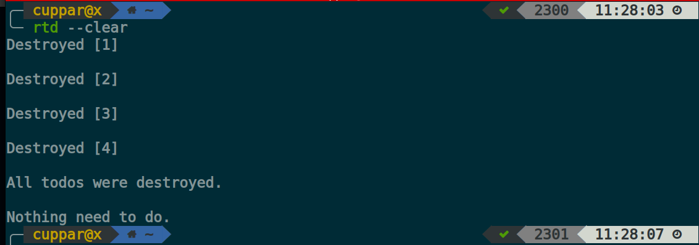

## 关于作者

何志颖(Cuppar He), 软件开发工程师, 喜欢编程, 技术写作，学习新东西, 尤其是计算机科学, 曾就职于[SAP](https://www.sap.com/)([世界百强](https://www.rankingthebrands.com/Brand-detail.aspx?brandID=22))和[阿里巴巴集团](https://www.alibabagroup.com/)([世界百强](https://www.rankingthebrands.com/Brand-detail.aspx?brandID=6245)&中国互联网巨头)。目前我在Gap Year, 如果你在寻找软件开发工程师并且能提供优质的offer(远程和现场都可以), 请与我联系`cuppar.hzy@gmail.com`。